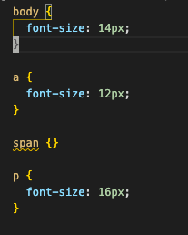

### 1. 怎么判断软链接是否成功?(20220224)

lerna 的一个重要问题就是解决包重复安装下载的问题.可这两天在使用 lerna add module 的时候,会给所有子包都安装这个 module

可按照 lerna 设计来讲的话,如果我要安装一个公共依赖,只需要安装的根目录下的 package.json 里面即可,为什么又要有这种命令安装到所有子包里面呢

实际情况究竟是

1. 每个子包都单独安装了 module?
2. 还是子包 a 已经安装 module,而子包 b 软链接了子包 a 的 module?

### [已解决]2. 软链接究竟是什么?表现形式是什么样的?(20220224)

#### 问题描述

一直以来就是根据字面意思进行理解的,就是将一个包指向另外一个包,更改了引用方式
可是在 npm 具体怎么表现的,我这种想法是否正确
心里没底
特别是现在用 lerna 来进行开发,如果还是迷迷糊糊的,咋弄?

#### 问题解决

- 使用 npm link '目标包的路径'
- 背后的逻辑
  - 将目标包添加到全局前缀的{npm prefix -g}lib/node_modules/目录下
  - 在当前包的 node_modules 中引用目标包
  - 目标包发生改变,当前包 node_modules 中的文件同步变化

### 3. yarn 如何自动安装 peerDependencies 依赖

#### 问题描述

在发布 stylelint,commitlint 以及 eslint 配置文件时,有些依赖是用户必要安装的
如果在文档中搞个 5,6 步安装所有依赖
就显的有点麻烦了
npm 7.x 以后可以自动安装 peerDependencies
但是 yarn 不行
如何破

1. styleint report 函数上报的异常,在终端显示不全(20220221)

**问题描述**

如题,有点儿像自动截断了字符,也好像是对中文支持不好

**源代码**

```javascript
const messages = ruleMessages(ruleName, {
  expected: (unfixed, fixed) => `用${fixed}替换${unfixed}`,
});

report({
  ruleName,
  result: postcssResult,
  message: messages.expected('14px', 'xxx'),
  node: decl,
  word: 'xxx',
});
```

**输出效果**

```bash
exmaples/test-a.css
 2:2  ✖  用xxx替换1     ranwawa/specify-font-size
```

**期望效果**
2:2 ✖ 用 xxx 替换 14px ranwawa/specify-font-size

```

```

2. vscode stylelint 插件无法识别自定义插件的错误

**问题描述**

通过 stylelint 命令行可以正常 report 错误

**错误截图**



**期望效果**

在 font-size 上也同样输出错误信息,并且显示 fix 按钮

### 4. npm pbulish 这个包@ranwawa/stylelint-config-scss 时总是报没有权限(20220225)

#### 问题描述

运行命令
npm publish --access public

总是返回下面的错误

```bash
npm ERR! code ENEEDAUTH
npm ERR! need auth This command requires you to be logged in.
npm ERR! need auth You need to authorize this machine using `npm adduser`
```

确认的是其他包能够正常上传

也试了重新登录

#### 问题解决

对比几个包的 package.json,发现这个包多了这样一段配置

```json
"publishConfig": {
    "registry": "https://registry.npmmirror.com/"
}
```

删除掉,重新发布就好了
